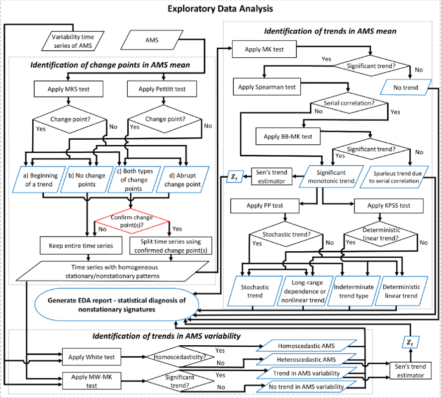

# EDA Framework

## Identification of Change Points in AMS Mean

- **AMS** stands for annual maximum streamflow.
- Define $\text{sign} (x)$ to be $1$ if $x > 0$, $0$ if $x = 0$, and $-1$ otherwise.
- Define $\mathbb{I}$ to be an **Indicator Random Variable**.

### Mann-Whitney-Pettitt Test

The **Mann-Whitney-Pettitt Test** is used to identify abrupt changes in a time series.

- Null Hypothesis: There are no abrupt changes in the time series.
- Alternative Hypothesis: There is _one_ abrupt change in the time series.

Given a time series $y_{1}, \dots, y_{n}$, we compute the following test statistics:

$$
U_{t} = \sum_{i=1}^{t} \sum_{j=t+1}^{n} \text{sign} (y_{j} - y_{i}), \quad K = \max_{t}|U_{t}|
$$

Then, we estimate the $p$-value using the following formula (for a one-sided test):

$$
p \approx \exp \left(-\frac{6K^2}{n^3 + n^2}\right)
$$

If $p < \alpha$, we reject the null hypothesis and conclude that there is an abrupt change at the value of $t$ such that $|U_{t}| = \text{max} |U_{t}|$. This is known as the **Change Point**.

### Mann-Kendall Sneyers (MKS) Test

Given a time series $y_{1}, \dots, y_{n}$, we compute the following test statistic:

$$
S_{t} = \sum_{i=2}^{t} \sum_{j=1}^{i-1} \mathbb{I}(y_{i} > y_{j})
$$

Then, we compute the the **Progressive Series** $UF_{t}$:

$$
UF_{t} = \frac{S_{t} - \mathbb{E}[S_{t}]}{\sqrt{\text{Var}\,(S_{t})}}
$$

For the MKS test, the values of $\mathbb{E}[S_{t}]$ and $\text{Var}(S_{t})$ are as follows:

$$
\begin{aligned}
\mathbb{E}[S_{t}] &= \frac{t(t-1)}{4} \\[5pt]
\text{Var}(S_{t}) &= \frac{t(t-1)(2t+5)}{72}
\end{aligned}
$$

Next, we need to find the **Regressive Series** $UB_{t}$. To do this, reverse $y_{1}, \dots , y_{n}$, compute and normalize $S_{t}$, and then reverse the resulting series to get back to the original time order.

Next, plot both $UF_{t}$ and $UB_{t}$ with confidence bounds. An intersection point between the two curves that lies outside the confidence indicates the start of the trend.

## Identification of Trends in AMS Mean

### Mann-Kendall (MK) Test

The MK test is used to determine if the AMS means have a statistically significant trend given a time series $y_{t}$.

$$
S = \sum_{i=1}^{n-1} \sum_{j=i+1}^{n} \text{sign} (y_{j} - y_{i}), \quad \tau  = \frac{2S}{n(n-1)}
$$

Under the null hypothesis of no trend, $\tau \sim \mathcal{N}(0, \frac{n(n-1)(2n+5)}{18})$.

### Spearman Test

The Spearman test is used to determine **Serial Correlation** (a dependence between the rankings of random variables). Let $X_{t}$ be the time series and $Y_{t}$ the AMS. Let $R$ be a ranking function (note that $R = 1$ is the smallest value). Then, let $d_{i} = R[X_{i}] - R[Y_{i}]$ be the difference in rank between observations. Compute:

$$
r_{s} = 1 - \frac{6 \sum_{}^{} d_{i}^2}{n(n^2-1)}
$$

assuming that there are no identical values in $X_{t}$ and $Y_{t}$. The test statistic $t$ is as follows:

$$
t = r_{s} \sqrt{\frac{n-2}{1 - r_{s}^2}} \sim T(n-2)
$$

### Block-Bootstrap Mann-Kendall (BB-MK) Test

1. Estimate the MK test statistic.
2. Run the [autocorrelation function](https://en.wikipedia.org/wiki/Autocorrelation) on a range of lags. Find the number of statistically significant serial correlations $k$. The optimal block length will be $k+1$.
3. Resample from the original time series in blocks, without replacement, and estimate the test statistic for each simulated sample.
4. Derive the distribution of the test statistic from the trend-free resampled series.
5. Estimate the significance of the observed test statistic (from step 1) using the simulated distribution (from step 3). If the original test statistic lies outside the bounds of the simulated distribution, then the trend is significant.

## Identification of Trends in AMS Variance

### PP Test

TBD

### KPSS Test

TBD
