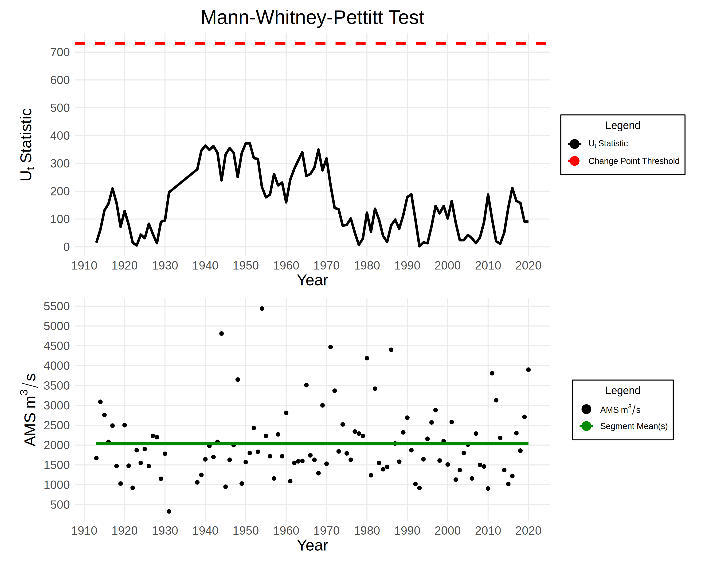
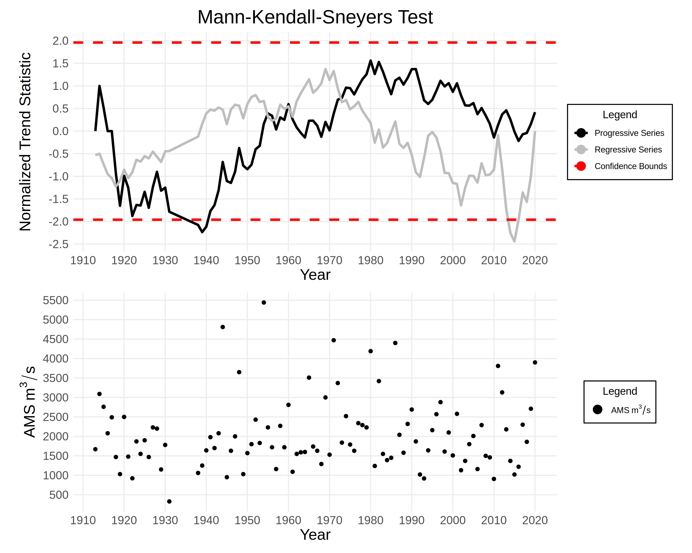

```{r setup, include=FALSE}
knitr::opts_chunk$set(echo = TRUE)
```

Dataset: `r params$dataset`

- The processed data contains annual max streamflow measurements between `r params$min_year` and `r params$max_year`.
- There are `r params$total_count` values in the dataset, `r params$na_count` of which are missing.

## Exploratory Data Analysis

### Mann-Whitney-Pettitt Test

**Purpose**: Detect abrupt changes in the annual max streamflow data.

**Result**: `r params$pettitt_report`

```{r, echo=FALSE}

```

### Mann-Kendall-Sneyers Test

**Purpose**: Detect the beginning of a change in trend in the annual max streamflow data.

**Result**: `r params$mks_report`

```{r, echo=FALSE}

```


