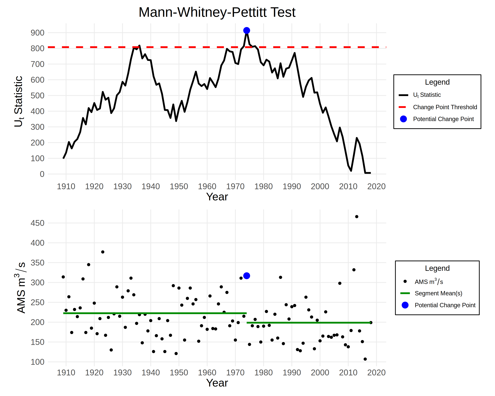
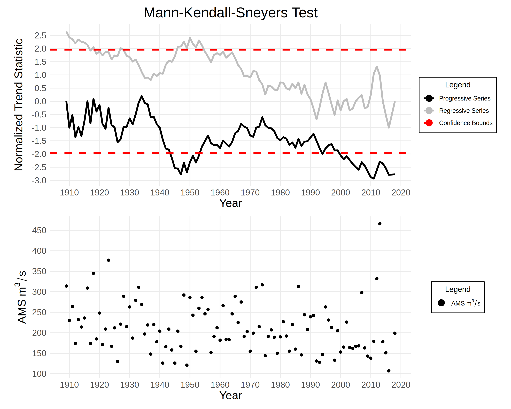

# Report

Dataset: Application_3.1.csv

## Data Preprocessing

- The processed data contains AMS measurements between 1909 and 2018.
- There are 109 non-missing values and 1 missing values.

## Exploratory Data Analysis

### Mann-Whitney-Pettitt Test

The **Mann-Whitney-Pettitt** test is used to detect abrupt changes in the AMS data.

 - The computed K-statistic is 914 and the corresponding p-value is 0.022.
 - At a significance level of 0.05, we reject the null hypothesis.
 - Therefore, we conclude that there is a potential change point in 1974.

### Mann-Kendall-Sneyers Test

The **Mann-Kendall-Sneyers** test is used to detect the beginning of a change in trend.

 - Using the MKS test, we conclude that there are no trends changes within the data.

